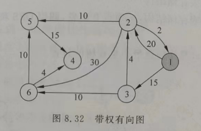

#### 前言:
还没复习完,别着急,目前复习到第二章


 #### 第一章 绪论(22级软工)        

 1. (单选题) 在数据结构中从逻辑上可以把数据结构分为（C）两类

    A. 动态结构和静态结构
    B. 紧凑结构和非紧凑结构
    C. 线性结构和非线性结构
    D. 内部结构和外部结构

 2. (单选题)数据的逻辑结构是（A）关系的整体。

    A. 数据元素之间逻辑
    B. 数据项之间逻辑
    C. 数据类型之间
    D. 存储结构之间

 3. (单选题)数据结构在计算机内存中的表示是指（A）。
A. 数据的存储结构
B. 数据结构
C. 数据的逻辑结构
D. 数据元素之间的关系

 4. (单选题)在数据结构中，与计算机无关的是（A）。
A. 逻辑结构
B. 存储结构
C. 逻辑结构和存储结构
D. 物理结构


  5. (单选题)算法的时间复杂度与（A）有关。

  A. 问题规模
  B. 计算机硬件性能
  C. 编译程序质量
  D. 程序设计语言

  6. (单选题)算法分析的目的是（C）。
    A. 找出数据结构的合理性
    B. 研究算法中的输入和输出关系
    C. 分析算法的效率以求改进
    D. 分析算法的易读性和文档性

  7. (单选题)算法的空间复杂度是指（D）

  A. 算法中输入数据所占用的存储空间的大小
  B. 算法本身所占用的存储空间的大小
  C. 算法中占用的所有存储空间的大小
  D. 算法中需要的临时变量所占用存储空间的大小

   8. (填空题)数据的逻辑结构是指（**数据元素之间的逻辑关系** ）。


  9. (填空题)一个算法具有5个特性，即(**可行性,有穷性,确定性 **)有输入和有输出

  10. (填空题)在分析算法的时间复杂度时，通常认为该算法的执行时间是( **问题规模**)的函数。

  11. (简答题)分析下面算法的时间复杂度。
      `````` C++
      void fun(int n){ int y=0;while(y*y<=n) y++；} 
      ``````
      
      *正确答案：* 
      
      设基本运算y++的执行次数为T(n)，则有以下关系，T(n)*T(n)≤n，即T(n)­2≤n;
      
      T(n)≤O($\sqrt n$) =O($\sqrt n$) 该算法的时间复杂度为**O($\sqrt n$) **
      
  12. (简答题)分析以下算法的时间复杂度

      ```````C++
      void fun(int n){ int i, j, x=0; for(i=1; i<n; i++)for(j=i+1; j<=n; j++) x++; } 
      ```````

      *正确答案：* $n^2$

 #### 第二章线性表

 1. (单选题)线性表是（A）

    A. 一个有限序列，可以为空
    B. 一个有限序列，不可以为空
    C. 一个无限序列，可以为空
    D. 一个无限序列，不可以为空

2. (单选题)在一个长度为n的顺序表向第i个元素(1≤i≤n+1)之前插入一个新元素时需要向后移动（B）个元素。

   A. n-i
   B. n-i+1
   C. n-i-1
   D. i

3. (单选题)顺序表具有随机存取的特性指的是（ C）。

   A. 查找值为x的元素与顺序表中的元素的个数n无关
   B. 查找值为x的元素与顺序表中的元素的个数n有关
   C. 查找序号为i的元素与顺序表中元素的个数n无关
   D. 查找序号为i的元素与顺序表中元素的个数n有关

 4. (单选题)顺序表和链表相比存储密度较大，这是因为（B ）。

    A. 顺序表的存储空间是预先分配的
    B. 顺序表不需要增加指针来表示元素之间的逻辑关系
    C. 链表的所有结点是连续的
    D. 顺序表的存储空间是不连续的

 5. (单选题)链表不具有的特点是（A）。
    A. 可随机访问任一元素
    B. 插入、删除不需要移动元素
    C. 不必事先估计存储空间
    D. 所需空间与线性表长度成正比

  > 由于链表的元素之间没有连续的内存空间，因此无法通过索引或随机访问来直接访问任一元素。相反，必须从头节点开始，按顺序遍历链表才能访问特定位置的元素。

 6. (单选题)通过含有n(n≥1)个元素的数组a，采用**头插法**建立一个单链表L，则L中结点值的次序（B ）。
    A. 与数组a的元素次序相同
    B. 与数组a的元素次序相反
    C. 与数组a的元素次序无关
    D. 以上都不对

  > 头插法指的是从头部对链表进行操作

 7. (单选题)在一个单链表中，若p结点不是尾结点，在其后插入s结点的操作是（ B ）。
    A. s->next = p; p->next = s;
    B. s->next = p->next; p->next = s;
    C. s->next = p->next; p = s;
    D. p->next = s; s->next = p;

 8. (单选题)在单链表中删除p所指结点的后继结点，该算法的时间复杂度为（ B ）。
    A. O($log_2{n}$)
    B. O(1)
    C. O($\sqrt n$)
    D. O(n)

 9. (单选题)某线性表最常用的运算是在尾元素之后插入元素和删除尾元素，则以下（D）存储方式最节省时间。
    A. 单链表
    B. 循环单链表
    C. 双链表
    D. 循环双链表

  >选项A、单链表插入最后一个元素需要遍历链表到最后一个元素。 
  >
  >选项B、仅有头指针，删除第一个元素方便，但是末尾插入一个元素同选项A。 
  >
  >选项C、双链表，方便来回遍历但是末尾插入一个元素依旧需要遍历整个链表。 
  >
  >选项D、有尾指针的循环单链表，可以在末尾插入元素后，尾指针移动一次至首结点删除第一个结点。 
  >
  >故D选项最节约运算时间。

 10. (填空题)在一个单链表L中，已知p指向某个非尾结点，若要删除其后继结点，并释放其空间，则执行的操作是 (q=p->next ,p->next=q->next ,free(q) )。

 11. (填空题)在一个双链表L中，若要在p结点（非尾结点）之前插入一个结点s，则执行的操作是

     ________s->prior=p->prior ____,________p->prior->next=s ___,___ s->next=p______,______ p->prior=s ____;

     > 在这里，“prior”表示指向前一个节点的指针。在双链表中，每个节点有两个指针：`next`指向下一个节点，`prior`（有时也称为`prev`）指向前一个节点。这使得双链表可以双向遍历，即可以向前或向后移动通过链表。

三. 算法设计题（共3题，21.6分）

  12. (算法设计题)某非空单链表L中的所有元素为整数，设计一个算法将所有小于零的结点移到所有大于零的结点的前面。

```` c++
/**
 * Definition for singly-linked list.
 * struct ListNode {
 *     int val;
 *     ListNode *next;
 *     ListNode() : val(0), next(nullptr) {}
 *     ListNode(int x) : val(x), next(nullptr) {}
 *     ListNode(int x, ListNode *next) : val(x), next(next) {}
 * };
 */
class Solution {
    public:
    ListNode* move(ListNode* head, int n) {
        bool flaga = 1;
        ListNode* i = head;
        ListNode* a = new ListNode();
        ListNode* j = a;
        // 以下是头节点的判断,需特殊处理
        if(head -> val < 0){
            head = head -> next;
        }
        auto del = [&] (ListNode* rm) -> void{
            ListNode* temp = rm -> next;
            rm -> next = temp -> next;delete temp;
        };
        while (i->next->next != nullptr) {
            ListNode* temp = i -> next;
            if(temp -> val < 0){
                j -> val = temp -> val;
                j -> next = new ListNode();
                del(i);
                j = j -> next;
            }
            i = i -> next;
        }
        // 删除小于零的,最后merge 一下
        if(i -> next -> val < 0) {
            j -> val = i -> next -> val;
            j -> next = new ListNode();
            del(i);
        }
        j -> next = head;
        return a;

    }
};


````


 13. (算法设计题)有一个带头结点的非空单链表L，设计一个算法，删除其中第1,3,5，...的结点，即删除奇数序号的结点，并讨论算法的时间复杂度。

     ````c++
     
     /**
      * Definition for singly-linked list.
      * struct ListNode {
      *     int val;
      *     ListNode *next;
      *     ListNode() : val(0), next(nullptr) {}
      *     ListNode(int x) : val(x), next(nullptr) {}
      *     ListNode(int x, ListNode *next) : val(x), next(next) {}
      * };
      */
     class Solution {
         public:
         ListNode* removeNthFromEnd(ListNode* head, int n) {
             ListNode* i = head;
             bool flag = 0;
             auto del = [&] (ListNode* rm) -> void{
                 ListNode* temp = rm -> next;
                 rm -> next = temp -> next;delete temp;
             };
             head = head -> next;
             i = head;
             if(i == nullptr) {
                 return nullptr;
             }
             while(i -> next != nullptr && i -> next -> next != nullptr) {
                 if(!flag) {
                     del (i);
                     flag = 0;
                 }
                 else {
                     flag = 1;
                 }
                 i = i -> next;
             }
             if(!flag&& i -> next != nullptr) {
                 del(i);
             }
             return head;
         }
     };
     
     
     
     ````


  14. (算法设计题)设计一个算法删除非空循环双链表L中第一个值为x的结点，成功操作返回true，否则返回false。

`````c++
#define NULL nullptr 
typedef struct DNode {
    int data;
    struct DNode *prior, *next;
} DNode, *DLinkedList;
class Solution {
    public:
    bool deleteFirstX(DLinkedList L, int x) {
        if (L == NULL || L->next == L) { // 空链表或仅含一个节点的情况
            return false;
        }

        DNode *p = L->next; // 从第一个节点开始
        while (p != L && p->data != x) { // 遍历链表，直到找到值为x的节点或回到头节点
            p = p->next;
        }

        if (p == L) { // 如果回到头节点，说明没有找到值为x的节点
            return false;
        }

        // 找到值为x的节点，进行删除操作
        p->prior->next = p->next;
        p->next->prior = p->prior;
        delete p; 
        return true;
    }
};

`````

#### 第三章栈和队列(22级软工)
 1. (单选题)设一个栈的输入序列是a,b,c,d，则借助一个栈所得到的输出序列不可能是（D）。
    A. a,b,c,d
    B. d,c,b,a
    C. a,c,d,b
    D. d,a,b,c

 2. (单选题)已知一个栈的进栈序列是1,2,3，...，n，其输出序列是p1,p2,...,pn，若p1=n，则pi的值是（C ）。
    A. i
    B. n-i
    C. n-i+1
    D. 不确定

 3. (单选题)设环形队列的存储空间为a[0..20]，且当前队头指针f（f指向队首元素的前一个位置）和队尾指针r（r指向队尾元素）的值分别为8和3，则该队列中元素的个数为（C）。

      A. 5
      B. 6
      C. 16
      D. 17

> 在环形队列中，队尾指针r指向队尾元素的下一个位置，而不是最后一个元素本身。这里有一个关键的点需要弄清楚：队头指针f是指向队首元素前一个位置，而队尾指针r是指向队尾元素的下一个位置。
>
> 给定队列的存储空间是`a[0..20]`，这意味着队列可以有21个位置来存储元素（索引从0到20）。由于队列是环形的，如果队尾指针r的值小于队头指针f的值，则队列已经“绕过”了数组的末尾，并从数组的开始处继续存储元素。
>
> 队列中元素的个数可以通过下面的公式计算：
>
> ```
> 元素个数 = (r - f + 队列大小) % 队列大小
> r -> rail 
> f -> front
> ```

 4. (单选题)最适合用作链队的链表是（B）。
    A. 带队首指针和队尾指针的循环单链表
    B. 带队首指针和队尾指针的非循环单链表
    C. 只带队首指针的非循环单链表
    D. 只带队首指针的循环单链表

  > - **队首指针**用于访问或删除队列的第一个元素（出队操作）。
  > - **队尾指针**用于在队列的末尾添加新元素（入队操作）。
  >
  > 这种结构使得入队和出队操作都能高效地进行，因为你无需遍历整个链表即可找到队首和队尾。在循环链表中，进行这些操作可能会更复杂，特别是当需要处理循环的逻辑时。只有队首指针的链表在进行入队操作时效率较低，因为需要遍历整个链表以找到队尾。

  5. (填空题)当两个栈共享一个存储区时，栈利用一维数组data[1..n]表示，栈1在低下标处，栈2在高下标处，两栈顶指针为top1和top2，初始值分别为0和n+1，则当栈1空时top1为______0_______，栈2空时top2为____n+1______,栈满时为_____top1 + 1 = top2________。
  6. (填空题)用一个大小为8的数组来实现环形队列，队头指针front指向队头元素的前一个位置，队尾指针rear指向队尾元素位置。当前front和rear的值分别为0和5，现在进队3个元素，又出队3个元素，此时front和rear的值分别为_____3______,______0___。

 #### 第四章串
 1. (单选题) 串的长度是（ D ）。
    A.串中不同字母的个数
    B.串中不同字符的个数
    C.串中所含字符的个数，且大于0
    D.串中所含字符的个数

 2. (单选题) 在BF模式匹配算法中，当模式串位j与目标串位i比较时两字符不相等，则i的位移方式是（C）。
    A.i++
    B.i=j+1
    C.i=i-j+1
    D.i=j-i+1

  > 暴力匹配（Brute Force，简称BF）

 3. (单选题)在BF模式匹配算法中，当模式串位j与目标串位i比较时两字符不相等，则j的位移方式是（B）。
    A.j++
    B.j=0
    C.j=i-j+1 
    D.j=j-i+1

  > j 代表的是一个长度,每次会重置

 4. (单选题)在KMP模式匹配中用next数组存放模式串的部分匹配信息，当模式串位j与目标串位i比较时两字符不相等，则i的位移方式是（A）。
    A.i=next[j]
    B.i不变
    C.i=0
    D.i=i-j+1

  > 在KMP算法中，next数组存放了模式串的部分匹配信息，它告诉我们在模式串不匹配的情况下，应该将模式串向右移动多少位，以便继续匹配。因此，当模式串的第j个字符与目标串的第i个字符不相等时，i的位移方式是将i移动到next[j]的位置，继续尝试匹配。

 5. (单选题)在KMP模式匹配中用next数组存放模式串的部分匹配信息，当模式串位j与目标串位i比较时两字符不相等，则j的位移方式是（D）。
    A.j=0
    B.j=next[i]
    C.j不变
    D.j=next[j]

  > 在KMP算法中，next数组存放了模式串的部分匹配信息，它告诉我们在模式串不匹配的情况下，应该将模式串的指针j移动到next[j]的位置，继续尝试匹配。这是KMP算法的关键部分，用来避免不必要的比较，提高匹配效率。

 6. (单选题) 设目标串为s，模式串为t，在KMP模式匹配中，next[4]=2的含义是（ B ）。
    A.表示目标串匹配失败的位置是i=4
    B.表示模式串匹配失败的位置是j=2
    C.表示$t_4$字符前面最多有两个字符和开头的两个字符相同
    D.表示$s_4$字符前面最多有两个字符和开头的两个字符相同

 7. (简答题) 已知t="abcaabbcab"，求t的nextval数组值。

  a b  c a a b  b c a b

  0 0 0 0 0 1 1 2 3 1 

  > `nextval`数组用于存储模式串中每个字符位置之前子串的最长相等前后缀长度。
#### 第五章递归
 1. (单选题) 一个正确的递归算法通常包含（C）。
    A.递归出口
    B.递归体
    C.递归出口和递归体
    D.以上都不包含

 2. (单选题) 递归函数f(1)=1，f(n)=f(n-1)+n (n>1)的递归体是（C）。
    A.f(1)=1
    B.f(0)=0
    C.f(n)=f(n-1)+n
    D.f(n)=n

 3. (单选题) 将递归算法转换成对应的非递归算法时，通常需要使用（B）保存中间结果
    A.队列
    B.栈
    C.链表
    D.树

  > 栈的特点就是先进后出,后进先出,与递归的一些特征比较吻合

 4. (填空题) 将f(n)=1+$\frac{1}{2}$+$\frac{1}{3}$+...+$\frac{1}{n}$转化成递归函数，其递归出口是________n == 1_______,递归体是______f(n) ==___$\frac{1}{n}$+F(n-1)______________。

 5. (算法设计题) 设计一个递归算法，利用串的基本运算SubStr()判断字符x是否在串s中。

``````c++
#include <bits/stdc++.h> 
using namespace std;
bool slove(string a,char s,int pos,int len) {
    if(len == 0) {
        return false;
    }
    else if(len == 1){ 
        return (a[pos] == s);
    }
    else {
        return (slove(a,s,pos,len>>1)|slove(a,s,pos+(len>>1)+1,len>>1));
    }
}
int main (){
    string a = "asdxcadgdfgdh";
    char s = 'a';
    //cin>>a>>s;
    cout<<(slove(a,s,0,a.length())?"YES":"NOT");
}
``````

#### 第七章 树 (大概)

 1. (单选题) 对一棵具有n个结点、度为4的树来说，（ C ）。
    A.树的高度最多是n-3
    B.树的高度最多是n-4
    C.第i层上最多有4(i-1)个结点
    D.至少在某一层上正好有4个结点

 2. (单选题) 若3次树中有a个度为1的结点、b个度为2的结点、c个度为3的结点，则该树有（D）个叶子结点。
    A.1+b+3c
    B.1+2b+3c
    C.2b+3c
    D.1+b+2c

  > 三次树为度不超过3

 3. (单选题) 用孩子链存储结构表示树，其优点之一是（ B ）比较方便。
    A.判断两个指定结点是不是兄弟
    B.找指定结点的双亲
    C.判断指定结点在第几层
    D.计算指定结点的度数

 4. (单选题) 设F是一个森林，B是由F变换的二叉树。若F中有m个分支结点，则B中右指针域为空的结点有（C）个。
    A.m-1
    B.m
    C.m+1
    D.m+2

 5. (单选题) 一棵有126个叶子结点的完全二叉树最多有（D）个结点。
    A.250
    B.251
    C.252
    D.253

 6. (单选题) 设有15个值，用它们组成一棵哈夫曼树，则该哈夫曼树共有（D）个结点。
    A.15
    B.14
    C.30
    D.29

  > 哈夫曼树只有度为0和2的结点，设度为0的结点个数为x，度为2的结点个数为y，则x+y=2y+1，所以x-1=y，x即为15，也就是叶子结点，所以总结点个数为14+15=29.

 7. (单选题) 根据使用频率，为5个字符设计的哈夫曼编码不可能是（D）。
    A.111，110，10，01，00
    B.000，001，010，011，1
    C.100，11，10，1，0
    D.001，000，01，11，10

  > 这JB题有点抽象,就是D的图推出来之后出现了一个度为1 的点,但是哈夫曼树中只存在度为2或者是0的点

 8. (填空题) 高度为h，度为m（m≥2）的树中最少有____$h+1-m$_________个结点，最多有____$m^0 + m^1 + m^2 + m^3 + ...... + m^h-1$________个结点。

    > 我们通常说一个树度数为M,就说明他是一个M叉树[something useful](https://www.acwing.com/blog/content/36987/)

 9. (填空题) 一共8层的完全二叉树至少有____$128$________个结点，具有100个结点的完全二叉树中结点的最大层数为____$7$______。

 10. (填空题) 完全二叉树中结点个数为n（n>2)，按层序编号（根结点编号为1），则编号最大的分支结点的编号是_________$\lfloor \frac{n}{2} \rfloor$___ ___，编号最小的叶子结点的编号是______$\lfloor \frac{n}{2} \rfloor$  or _____________。
 11. (填空题) 一棵二叉树的根结点为a，其中序序列的第一个结点是___________________，其中序序列的最后一个结点是________________________。
 12. (填空题) 设一棵完全二叉树（每个结点值为单个字符）的顺序存储结构中存储数据元素为abcdefg，则该二叉树的先序序列为_________________，中序序列为_____________，后序序列为______________。


 13. (填空题) 线索二叉树的左线索指向其__________结点，右线索指向其________________结点。

前驱

后继


 三. 简答题（共3题，15.9分）
 14. (简答题) 一棵二叉树的先序、中序和后序序列分别如下，其中有一部分未显示出来。试求出空格处的内容，并画出该二叉树。先序序列：__B__F__ICEH__G中序序列：D__KFIA__EJC__后序序列：__K__FBHJ__G__A


 15. (简答题) 已知一棵完全二叉树共有892个结点，试求： （1）树的高度 （2）单分支结点数 （3）叶子结点数 （4）最后一个分支结点的序号


 16. (简答题) 假设一段正文由字符集{a,b,c,d,e,f,g,h}中的字母构成，这8个字母在这段正文中出现的次数分别是{12，18，26，6，4，34，8，15}。回答以下问题： （1）画出哈夫曼树 （2）为这8个字母设计哈夫曼编码


 四. 算法设计题（共3题，15.9分）

 17. (算法设计题) 假设二叉树中每个结点值为单个字符（所有结点值不相同），采用二叉链存储结构，设计一个算法 void findparent(BTNode *b, char x, BTNode * &p)求二叉树中指定值为x的结点的双亲结点p。


 18. (算法设计题) 假设二叉树采用二叉链存储结构，设计一个算法，利用结点的右孩子指针rchild将一棵二叉树的叶子结点按从左往右的顺序串成一个单链表。


 19. (算法设计题) j假设二叉树中每个结点值为单个字符，利用二叉链存储结构存储，试设计一个算法，采用后序遍历方式求一棵二叉树b中的所有小于x的结点个数。


 #### 第八章图
 一. 单选题（共10题，58.7分）
 1. (单选题) 所谓简单路径是指除了起点和终点以外（ ）。 
A.任何一条边在这条路径上不重复出现
B.任何一个顶点在这条路径上不重复出现
C.这条路径由一个顶点序列构成，不包含边
D.这条路径由边序列构成，不包含顶点
 2. (单选题) 带权有向图G用邻接矩阵A存储，则顶点i的入度等于A中（）。
A.第i行非∞的元素之和
B.第i列非∞的元素之和
C.第i行非∞的且非0的元素个数
D.第i列非∞的且非0的元素个数
 3. (单选题) 在一个无向图中，所有顶点的度之和等于边数的（）倍。
A.1/2
B.1
C.2
D.3
 4. (单选题) 设G是一个非连通无向图，有15条边，则该图至少有（）个顶点。
A.5
B.6
C.7
D.15
 5. (单选题) 一个有n个顶点的无向图最多有（）条边。
A.n
B.n(n-1)
C.n(n-1)/2
D.2n
 6. (单选题) 若图的邻接矩阵中主对角线上的元素全是0，其余元素全是1，则可以断定该图一定是（）
A.无向图
B.非带权图
C.有向图
D.完全图
 7. (单选题) 一个无向连通图的生成树是含有该连通图的全部顶点的（）。
A.极小连通子图
B.极小子图
C.极大连通子图
D.极大子图
 8. (单选题) 用Prim算法求一个连通的带权图的最小生成树，在算法执行的某时刻，已选取的顶点集合U={1，2，3}，已选取的边的集合TE={（1，2），（2，3）}，要选取下一条权值最小的边，应当从（）组中选取。
A.{（1，4），（3，4），（3，5），（2，5）}
B.{（4，5），（1，3），（3，5）}
C.{（1，2），（2，3），（3，5）}
D.{（3，4），（3，5），（4，5），（1，4）}
 9. (单选题) 用Kruskal算法求一个连通的带权图的最小生成树，在算法执行的某时刻，已选取的边集合TE={（1，2），（2，3），（3，5）}，要选取下一条权值最小的边，可能选取的边（）。 
A.（1，3）
B.（2，5）
C.（1，5）
D.（6，7）
 10. (单选题) 对于AOE网的关键路径，以下叙述中正确的是（）。
A.任何一个关键活动提前完成，则整个工程也会提前完成
B.完成工程的最短时间是从源点到汇点的最短路径长度
C.一个AOE网的关键路径是唯一的
D.任何一个活动持续时间的改变可能会影响关键路径的改变
 二. 填空题（共4题，23.6分）
 11. (填空题) 对于一个具有n个顶点、e条边的无向图，若采用邻接表表示，则头结点数组的大小为__________，边结点总数是____________。
 12. (填空题) 在一个AOE网中，某活动a的最早开始时间为e(a)，最迟开始时间为l(a)，该活动需要c天完成，若满足______________________，则称a为关键活动。
 13. (填空题) 对于含有n个顶点、e条边的有向无环图，拓扑排序算法的时间复杂度是_______________。
 14. (填空题) Prim算法适用于求____________图的最小生成树，Kruskal算法适用于求___________图的最小生成树。

 三. 简答题（共2题，11.8分）
 15. (简答题) 有如图8.26所示的带权有向图G，试回答以下问题。 （1）给出从顶点1出发的一个深度优先遍历序列和一个广度优先遍历序列 （2）给出G的一个拓扑序列（3）给出从顶点1出发到顶点8的最短路径及最短路径长度。 

 16. (简答题) 对于图8.32所示的有向图，试利用Dijkstra算法求出从源点1出发到其他各顶点的最短路径，并写出执行过程。（执行过程指的是S集合、dist[]数组及path[]数组的变化过程） 


 四. 算法设计题（共1题，5.9分）
 17. (算法设计题) 假设图G采用邻接表存储，写出基于BFS遍历的算法来判断顶点i和顶点j（i≠j)之间是否有路径。

#### 第九章查找
 一. 单选题（共5题，55.5分）

 1. (单选题) 不适合在链式存储结构上实现的查找算法是（）。
A.顺序查找
B.折半查找
C.二叉排序树查找
D.哈希查找

 2. (单选题) 有一个长度为12的有序表，按二分查找法对该表进行查找，在表内各元素等概率的情况下，查找成功所需的平均比较次数为_______________。
A.35/12
B.37/12
C.39/12
D.43/12

 3. (单选题) 以下关于二叉排序树的叙述中正确的是（）
A.二叉排序树是动态树表，在插入新结点时会引起树的重新分裂和合并
B.对二叉排序树进行层次遍历可以得到一个有序序列
C.在构造二叉排序树时，若关键字序列有序，则二叉排序树的高度最大。
D.在二叉排序树中进行查找，关键字的比较次数不超过结点数的一半。

 4. (单选题) 在含有27个结点的二叉排序树上查找关键字为35的结点，则依次比较的关键字序列有可能是（）。
A.28，36，18，46，35
B.18，36，28，46，35
C.46，28，18，36，35
D.46，36，18，28，35

 5. (单选题) 设哈希表长m=14，哈希函数h(key)=key mod 11，表中已有4个元素，addr(15)=4，addr(61)=6，addr(84)=7，其余地址为空，如用二次探测法（key± mod 11）处理冲突，则关键字为49的结点的地址是（）。
A.8
B.3
C.5
D.9

 二. 填空题（共3题，33.3分）
 6. (填空题) 对于两棵具有相同关键字而形状不同的二叉排序树，进行______________遍历时可以得到完全相同的序列。

 7. (填空题) 采用顺序查找方法查找含有n个元素的顺序表，若查找成功，则比较关键字的次数最多为___________次，若查找不成功，则比较关键字的次数为____________次。
第1空
n
第2空
n+1
 8. (填空题) 设有序表为{2，4，6，8，10，12，14，16，18，20}，采用折半查找方法查找元素14，一次比较的元素是_______________________。

 三. 简答题（共1题，11.2分）

 9. (简答题) 对于关键字序列{30，15，21，40，25，26，36，37}，若查找表的装填因子为0.8，采用线性探测法解决冲突，完成以下各题。 （1）设计哈希函数及画出哈希表 （2）计算等概率情况下查找成功和查找失败的ASL。

#### 第十章排序

 一. 单选题（共4题，57.1分）

 1. (单选题) 在下列排序方法中，某一趟排序结束后未必能选出一个元素放在其最终位置上的是（ ）。
A.堆排序
B.直接插入排序
C.冒泡排序
D.快速排序

 2. (单选题) 在下列排序方法中，执行时间不受数据初始状态影响，总为O()的是（）。
A.堆排序
B.冒泡排序
C.简单选择排序
D.快速排序

 3. (单选题) 若一组记录的关键字序列为（46,79,56,38,40,84），利用堆排序的方法建立的初始堆为（）。
A.79,46,56,38,40,80
B.84,79,56,38,40,46
C.84,79,56,46,40,38
D.84,56,79,40,46,38

 4. (单选题) 对数据序列（15,9,7,8,20，-1,4）进行排序，进行一趟排序后数据的排序变为（4,9，-1,8,20,7,15），则采用的是（）排序方法。
A.简单选择排序
B.冒泡排序
C.希尔排序
D.快速排序

 二. 填空题（共3题，42.9分）
 5. (填空题) 对一组数据（4,48,96,23,12,60,45,73）采用直接插入排序算法进行递增排序，当把60插入到有序表中时，为寻找插入位置需比较_________次。


 6. (填空题) 在排序过程中，任何情况下都不比较关键字大小的排序方法是___________。


 7. (填空题) 在二路归并排序中，若待排序记录的个数为20，则共需要进行__________趟归并，在第3趟归并中，把长度为________的有序表归并为长度为_______的有序表。
